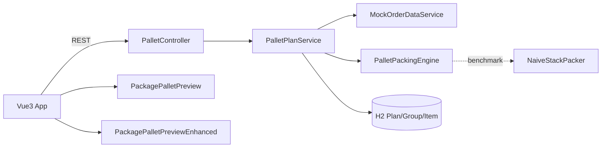

# 托盘摆放 Demo（Pallet Packing）

从 MES「销售订单托盘摆放」能力抽取的**可独立运行最小实现**，并增加增强版三维预览、引擎基准对比与 CI。

> 声明：本仓库为教学/作业演示用模拟工程，已去除公司敏感信息（内网地址、客户名、私有包等），数据为 Mock。


## 功能亮点

- **装载引擎** `PalletPackingEngine`：分组装托、层内摆放/碰撞、限重限高、混托规则、尾托合并、利用率
- **朴素基线** `NaiveStackPacker`：顺序单列堆叠，用于量化对比
- **双预览引擎**（页面可切换）
  - **原版** `PackagePalletPreview`：生产组件完整移植（木托盘/软阴影/旋转缩放）
  - **增强版** `PackagePalletPreviewEnhanced`：瓦楞材质+贴标、GTAO、OrbitControls、点选信息卡、分层/爆炸、装托动画、HUD/标尺
- **REST**：计算 / 预览 / 草稿 / 查看；H2 内存库持久化方案
- **Benchmark**：多组 mock 订单真实统计托数、利用率、耗时（见下方）

## 快速启动

```bash
# 后端（JDK 21 + Maven）
cd backend
mvn spring-boot:run

# 前端（另开终端）
cd frontend
npm install
npm run dev
```

浏览器打开 http://127.0.0.1:5173/  
默认预览为**增强版**；可在「预览引擎」下拉切回原版对比。

## 目录结构

```
├── backend/                 # Spring Boot + H2 + JUnit
│   └── src/main/java/com/example/pallet/
│       ├── engine/          # PalletPackingEngine + NaiveStackPacker
│       ├── service/         # Mock 订单 + 方案服务
│       └── controller/      # REST
├── frontend/
│   └── src/components/
│       ├── PackagePalletPreview/          # 原版（保留可对比）
│       └── PackagePalletPreviewEnhanced/  # 增强版
├── docs/                    # 动图、benchmark 图、架构素材
└── .github/workflows/ci.yml
```

## 架构



## 算法说明（简）

1. 按产品/包装规则分组；组内按层贪心摆放（可旋转），做平面碰撞与限重限高校验  
2. 可选混托：尾托合并、盒箱混托开关  
3. 输出每托 `BOX_LAYOUT`（坐标/占位尺寸/层号），供三维还原  
4. 输入指纹：参数未变可跳过重算  

朴素基线仅「单列向上堆叠，超限新开托」，用于证明引擎在托数与面积利用率上的优势。

## Benchmark 真实结果

本地执行：

```bash
cd backend && mvn -q test -Dtest=PalletPackingBenchmarkTest
# 输出 backend/target/benchmark/benchmark-results.json
```

某次真实运行摘要（30 次均值，机器环境相关，以 JSON 为准）：

| Suite | Engine 托数 | Naive 托数 | Engine 面积利用率 | Naive 面积利用率 | Engine ms | Naive ms |
|------|-------------|------------|-------------------|------------------|-----------|----------|
| single-12x400 | 1 | 2 | 0.75 | 0.125 | ~0.66 | ~0.03 |
| dense-24x300 | 1 | 4 | 1.00 | 0.063 | ~1.22 | ~0.03 |
| mixed-allow | 1 | 3 | 0.56 | 0.135 | ~0.43 | ~0.03 |
| large-48 | 1 | 7 | 0.73 | 0.081 | ~7.22 | ~0.04 |
| tall-stack | 1 | 3 | 0.83 | 0.208 | ~0.47 | ~0.01 |


原始数据：[`docs/benchmark-results.json`](docs/benchmark-results.json)

## 主要接口

| Method | Path | 说明 |
|--------|------|------|
| GET/POST | `/api/pallet-standard/listEnabled` | 托盘标准 |
| GET | `/api/sale-order/pallet/{orderId}` | 查询方案 |
| POST | `/api/sale-order/pallet/{orderId}/calculate` | 计算并保存 |
| GET | `/api/sale-order/pallet/{orderId}/preview?palletNo=` | 预览盒子列表 |
| PUT | `/api/sale-order/pallet/{orderId}/draft` | 保存草稿 |

示例订单：`ORDER-SINGLE` / `ORDER-MIX` / `ORDER-TAIL` / `ORDER-HEAVY` / `ORDER-TALL` / `ORDER-EMPTY`

## 测试与 CI

```bash
cd backend && mvn test
cd frontend && npm run build
```

GitHub Actions：push 后自动跑 `mvn test` + `npm run build`（见 `.github/workflows/ci.yml`）。

## 录屏素材

- 动画 MP4：`docs/pallet-packing-animation.mp4`
- README 动图：`docs/pallet-packing-animation.gif`

## License / 用途

仅供学习与作业演示，禁止用于还原生产敏感数据或未授权商业使用。
