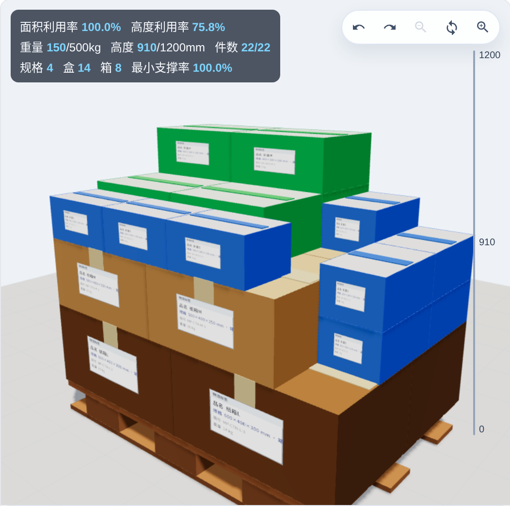
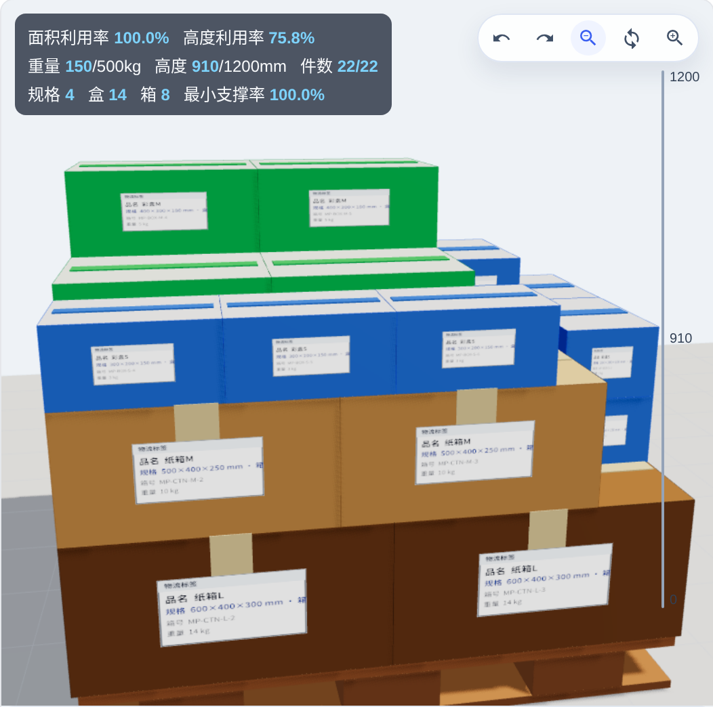
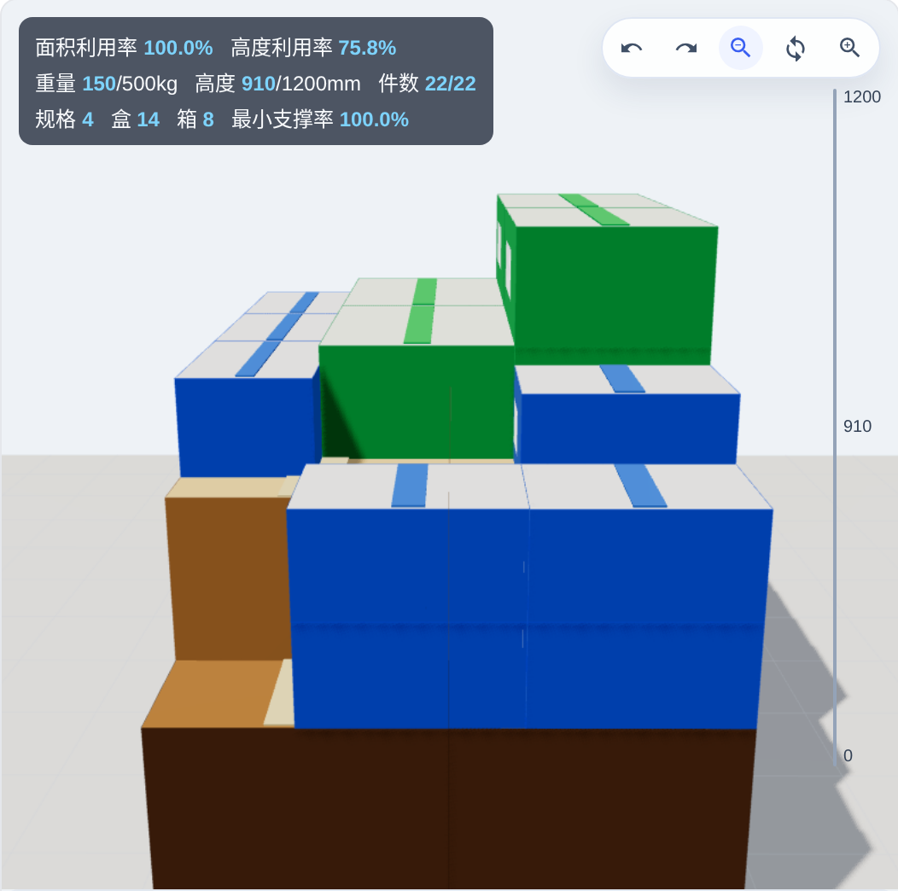
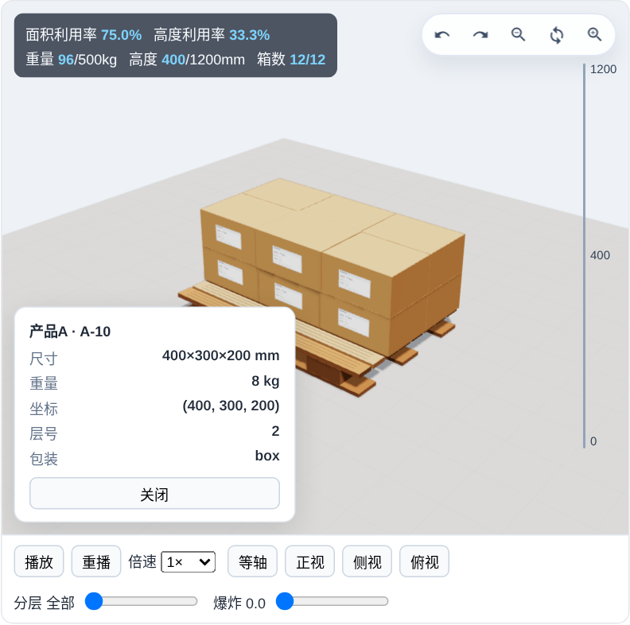
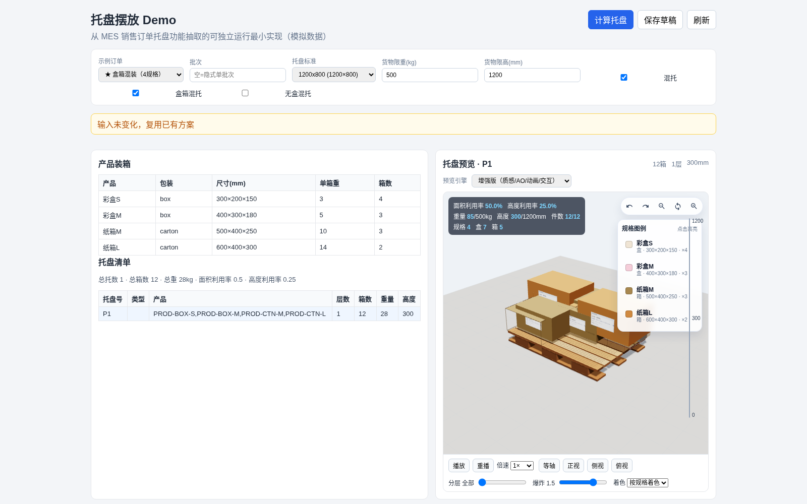
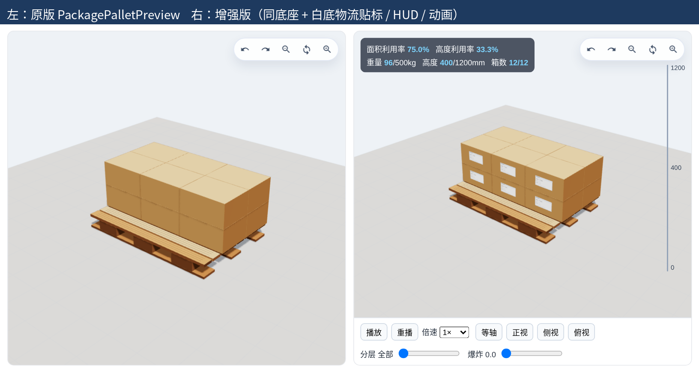
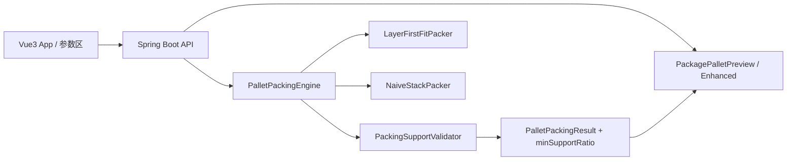
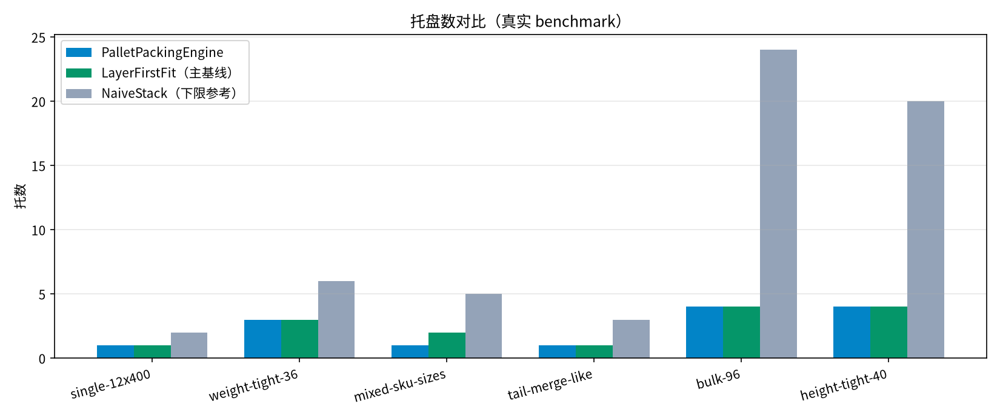
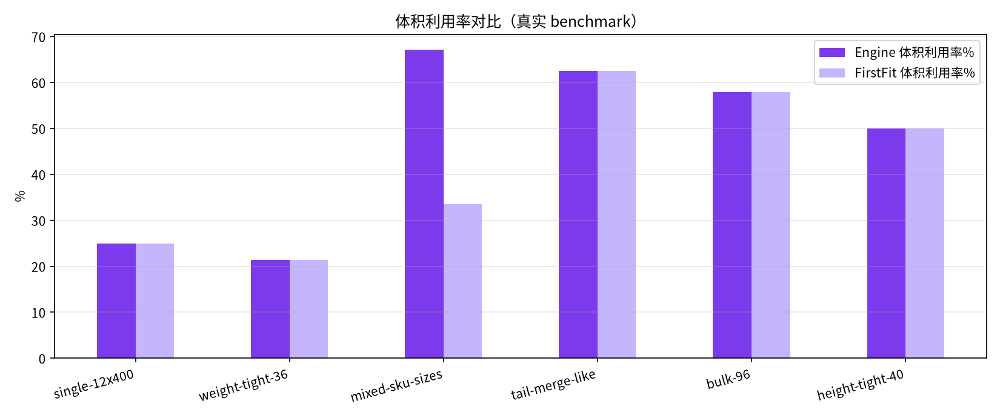

# 托盘摆放 Demo（Pallet Packing）

[](https://github.com/gethac/pallet-packing-demo/actions/workflows/ci.yml)

从生产 MES「销售订单托盘摆放」抽取的**模拟最小实现**：装托引擎 + 方案预览三维 + 可复现 Benchmark。敏感业务已剥离，数据为 Mock。


> 动画为增强版完整装托过程；HUD 显示**最小支撑率 100%**。MP4：[`docs/pallet-packing-animation.mp4`](docs/pallet-packing-animation.mp4)

## 功能亮点

- **装托引擎**：同产品优先满托、尾托合并、混托三开关（`allowMixedPallet` / `allowMixedPackagePallet` / `allowMixedNoBoxPallet`）
- **支撑约束与校验器**：底面支撑率默认可配置（≥0.80）、重心在支撑区、默认不允许超边；`PackingSupportValidator` 检查重叠/悬空/超边/超重超高
- **盒箱混装**：`ORDER-MIX-PACK` 等同托展示彩盒与纸箱多规格；规格着色 + 画布外图例
- **增强三维**：装托动画、预设视角、分层/爆炸、点选信息卡、HUD（利用率/限重限高/盒箱数/最小支撑率）；可切换回原版预览组件
- **方案稳健性**：订单级保存锁思路、`CALCULATION_INPUT_HASH` 跳过无变化重算（Demo 以服务层语义体现）

## 效果图

| 混装等轴特写 | 正视 | 侧视 |
|--------------|------|------|
|  |  |  |

| 点选信息卡 | 爆炸视图 | 原版 vs 增强 |
|------------|----------|--------------|
|  |  |  |

## 架构



- 后端：`backend/`（Java 21 · Spring Boot · JUnit5）
- 前端：`frontend/`（Vue3 · Vite · Three.js）
- 对比基线与引擎同一套支撑约束，保证 Benchmark 公平

## 算法说明

1. 任务按产品分组；组内按重量/体积大致重者优先。
2. `fillPallet`：优先铺满当前层（允许 90° 旋转、高度相近），再开新层；放置时计算支撑面积比与重心。
3. 尾托合并：在允许混托时合并，**续装不得丢弃已有层**。
4. 结果经 `PackingSupportValidator` 断言后返回；HUD 展示全托最小支撑率。

主对比基线为**分层 First-Fit**；`NaiveStackPacker`（单列堆叠）仅作下限参考。

## Benchmark

数据来源：[`docs/benchmark-results.json`](docs/benchmark-results.json)（支撑约束启用后）。

| Suite | Engine 托 | FirstFit 托 | Naive 托 | Eng 面积利用率 | FF 面积利用率 | Eng 体积利用率 |
|-------|----------:|------------:|---------:|---------------:|--------------:|---------------:|
| single-12x400 | 1 | 1 | 2 | 0.7500 | 0.7500 | 0.2500 |
| weight-tight-36 | 3 | 3 | 6 | 0.7500 | 0.7500 | 0.2143 |
| **mixed-sku-sizes** | **2** | **3** | **6** | **0.7682** | **0.3553** | **0.3353** |
| tail-merge-like | 1 | 1 | 3 | 1.0000 | 0.8333 | 0.6250 |
| bulk-96 | 4 | 4 | 24 | 0.6942 | 0.6942 | 0.5785 |
| height-tight-40 | 4 | 4 | 20 | 0.6875 | 0.6875 | 0.5000 |

各算法最小支撑率均为 **1.0**。混规格场景 Engine 比 FirstFit 少 1 托、面积利用率明显更高。





## 快速启动

```bash
# 后端
cd backend && mvn spring-boot:run
# 前端（另开终端）
cd frontend && npm install && npm run dev
```

- 前端默认：http://localhost:5173  
- 后端默认：http://localhost:8080  
- 建议打开示例订单 **「★盒箱混装」**，确认 HUD「最小支撑率」

```bash
# 测试与构建
cd backend && mvn test
cd frontend && npm run build
```

## 主要接口（Demo）

| 方法 | 路径 | 说明 |
|------|------|------|
| GET | `/api/sale-order/pallet/{orderId}` | 查询/刷新托盘计算结果 |
| GET | `/api/sale-order/pallet/{orderId}/view` | 只读查看已保存方案 |
| GET | `/api/sale-order/pallet/{orderId}/preview` | 单托盘盒子布局预览 |
| POST | `/api/sale-order/pallet/{orderId}/calculate` | 按标准/限重限高/混托规则计算 |
| PUT | `/api/sale-order/pallet/{orderId}/draft` | 保存草稿 |
| GET/POST | `/api/pallet-standard/listEnabled` | 启用中的托盘标准 |

Mock 订单由服务层内置（如 `ORDER-MIX-PACK`）；与生产路径语义对齐，已去除鉴权与租户细节。

## 目录结构

```
├── AGENTS.md                 # Codex 协作约定
├── CHANGELOG.md              # 版本与迭代记录
├── .codex/skills/            # 分阶段 skill（需求/原型/库表/引擎/BUG）
├── backend/                  # Spring Boot 引擎与 API
├── frontend/                 # Vue3 + Three.js 预览
├── docs/
│   ├── design/               # 需求/UI/DDL/ER/原型归档
│   ├── evidence/             # CI、diff、单测等过程证据
│   ├── gallery/              # README 展示用当前效果图
│   ├── history/              # v9/v10 旧图（仅 CHANGELOG 对比）
│   ├── ui-v11-*.png          # 当前混装三视角
│   ├── benchmark-*.png|.json
│   └── pallet-packing-animation.{gif,mp4}
└── .github/workflows/ci.yml
```

## 设计归档与 Codex

- 设计产物：[`docs/design/`](docs/design/)（需求规格、UI 规范、DDL、ER、线框/高保真、页面效果）
- 过程证据：[`docs/evidence/`](docs/evidence/)
- 协作约定：[`AGENTS.md`](AGENTS.md)
- Skills：[`.codex/skills/`](.codex/skills/)（`requirement-spec` / `prototype-ui` / `db-design` / `pallet-engine-dev` / `bugfix-spotbugs`）

## 迭代记录

详见 [`CHANGELOG.md`](CHANGELOG.md)。要点：弱基线 → First-Fit；三维简化回退 → 原版底座再增强；混装可见性 → 支撑约束消除悬空。

## License / 说明

仅供学习与作业演示。算法为工程启发式，不宣称全局最优。
