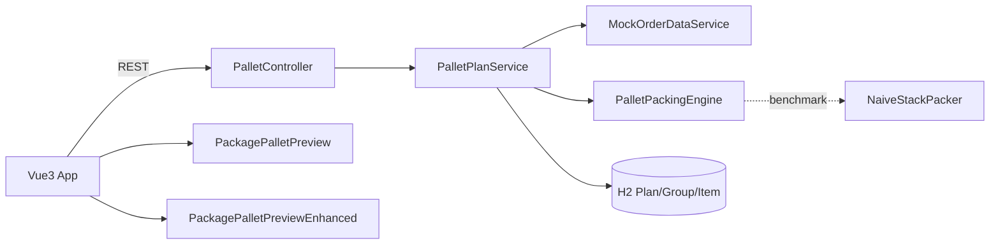
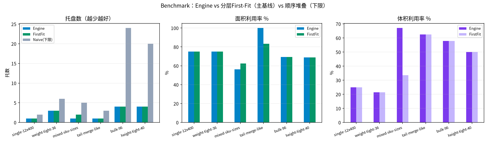
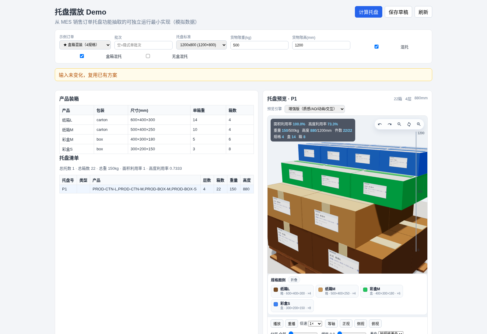
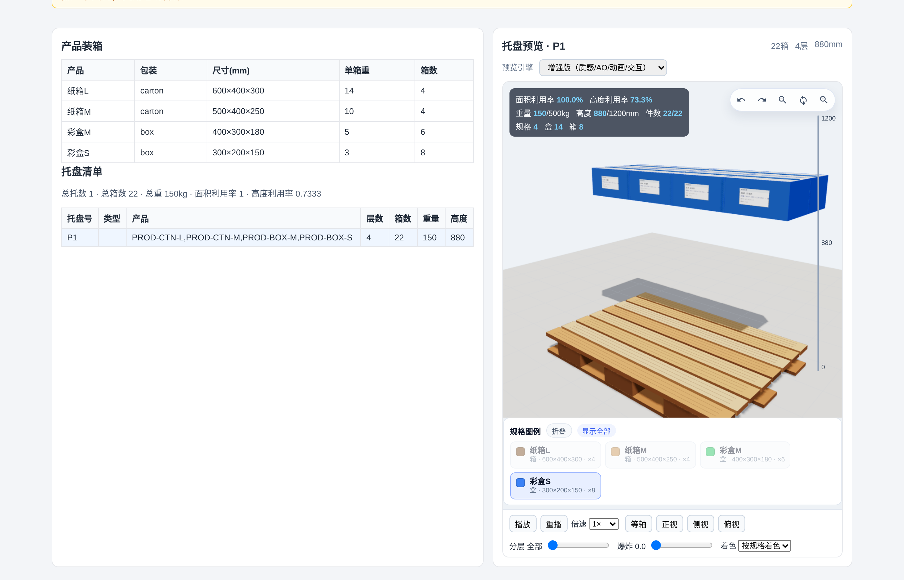
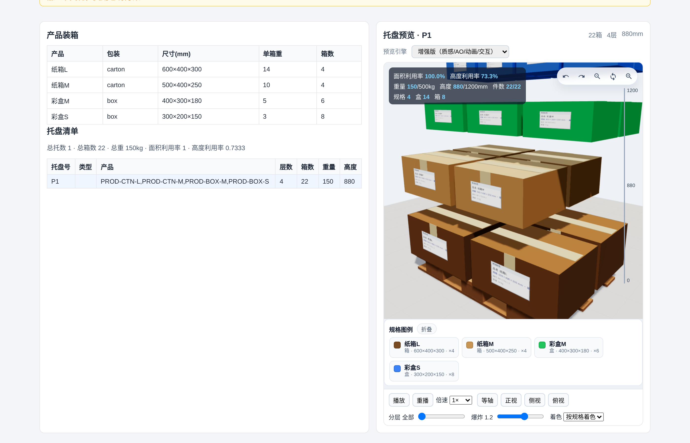
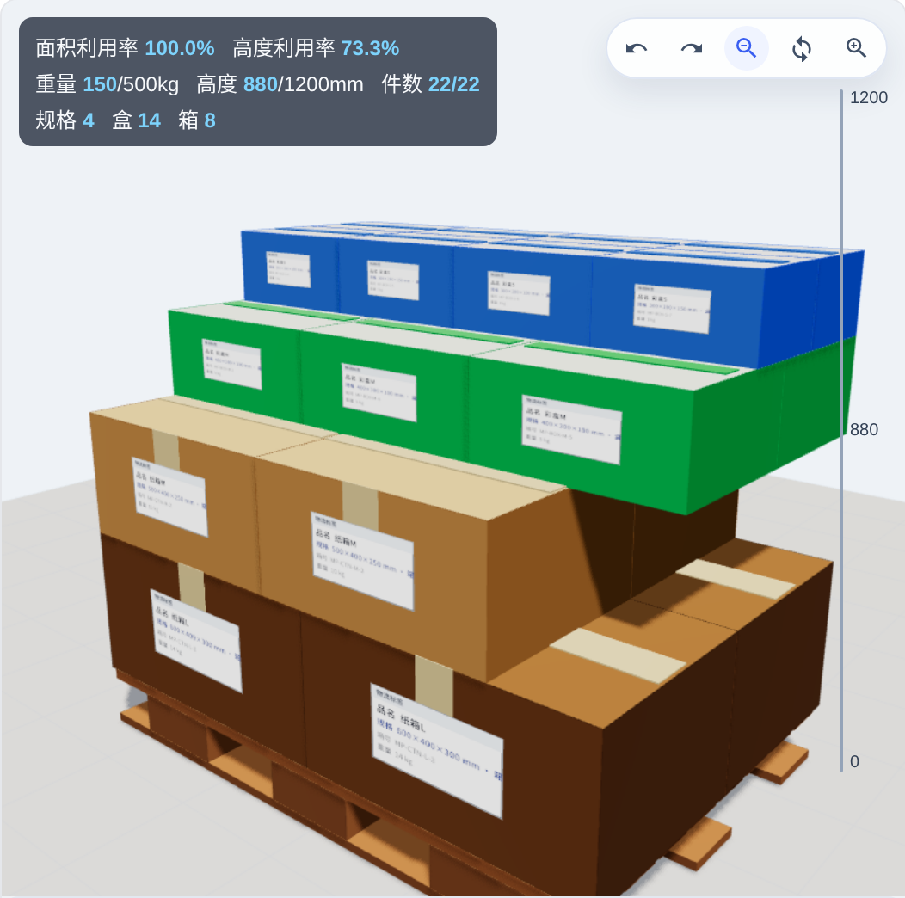
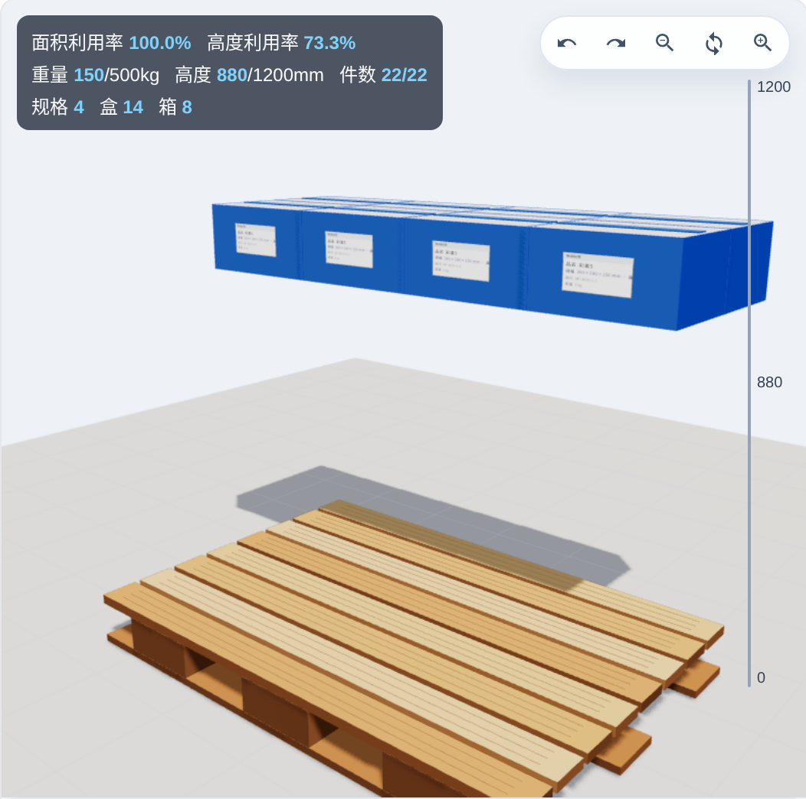
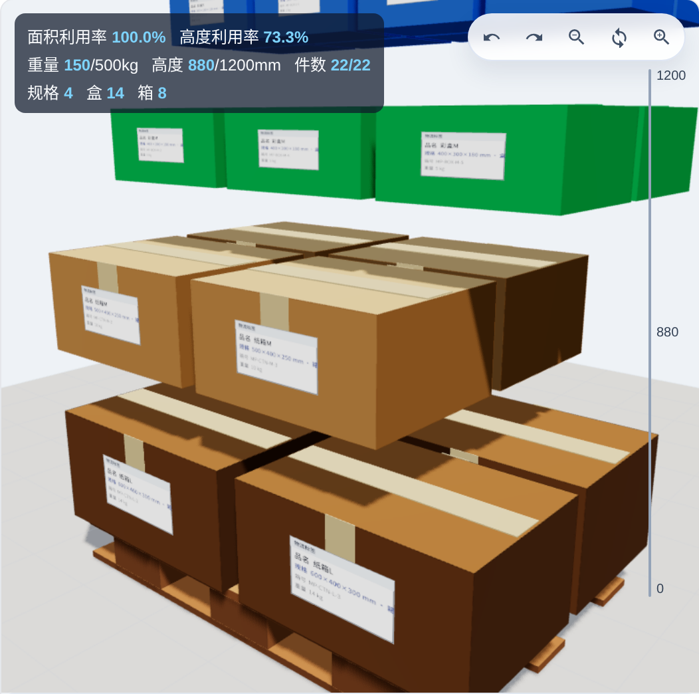

# 托盘摆放 Demo（Pallet Packing）

[](https://github.com/gethac/pallet-packing-demo/actions/workflows/ci.yml)

从 MES「销售订单托盘摆放」能力抽取的**可独立运行最小实现**，并增加增强版三维预览、引擎基准对比与 CI。

> 声明：本仓库为教学/作业演示用模拟工程，已去除公司敏感信息（内网地址、客户名、私有包等），数据为 Mock。


## 功能亮点

- **装载引擎** `PalletPackingEngine`：分组装托、层内摆放/碰撞、限重限高、混托规则、尾托合并、利用率
- **朴素基线** `NaiveStackPacker`：顺序单列堆叠，用于量化对比
- **双预览引擎**（页面可切换）
  - **原版** `PackagePalletPreview`：生产组件完整移植（木托盘/软阴影/旋转缩放）
  - **增强版** `PackagePalletPreviewEnhanced`：瓦楞/彩盒材质区分、按规格着色+图例高亮、贴标显示规格、GTAO、点选信息卡、分层/爆炸、装托动画、HUD（规格数/盒/箱）
- **REST**：计算 / 预览 / 草稿 / 查看；H2 内存库持久化方案
- **Benchmark**：多组 mock 订单真实统计托数、利用率、耗时（见下方）

## 快速启动

```bash
# 后端（JDK 21 + Maven）
cd backend
mvn spring-boot:run

# 前端（另开终端）
cd frontend
npm install
npm run dev
```

浏览器打开 http://127.0.0.1:5173/  
默认预览为**增强版**；可在「预览引擎」下拉切回原版对比。

## 目录结构

```
├── backend/                 # Spring Boot + H2 + JUnit
│   └── src/main/java/com/example/pallet/
│       ├── engine/          # PalletPackingEngine + NaiveStackPacker
│       ├── service/         # Mock 订单 + 方案服务
│       └── controller/      # REST
├── frontend/
│   └── src/components/
│       ├── PackagePalletPreview/          # 原版（保留可对比）
│       └── PackagePalletPreviewEnhanced/  # 增强版
├── docs/                    # 动图、benchmark 图、架构素材
└── .github/workflows/ci.yml
```

## 架构



## 算法说明（简）

1. 按产品/包装规则分组；组内按层贪心摆放（可旋转），做平面碰撞与限重限高校验  
2. 可选混托：尾托合并、盒箱混托开关  
3. 输出每托 `BOX_LAYOUT`（坐标/占位尺寸/层号），供三维还原  
4. 输入指纹：参数未变可跳过重算  

朴素基线仅「单列向上堆叠，超限新开托」，用于证明引擎在托数与面积利用率上的优势。

## Benchmark 真实结果

主基线：**分层 First-Fit**（`LayerFirstFitPacker`，固定朝向、贪心行列平铺、限重限高）。  
下限参考：**顺序单列堆叠**（`NaiveStackPacker`）。  

```bash
cd backend && mvn -q test -Dtest=PalletPackingBenchmarkTest
```

一次真实运行摘要（25 次均值，环境相关，以 JSON 为准）：

| Suite | Engine托数 | FirstFit托数 | Naive托数(下限) | Engine面积 | FirstFit面积 | Engine体积 | FirstFit体积 |
|------|------------|--------------|-----------------|------------|--------------|------------|--------------|
| single-12x400 | 1 | 1 | 2 | 0.750 | 0.750 | 0.250 | 0.250 |
| weight-tight-36 | 3 | 3 | 6 | 0.750 | 0.750 | 0.214 | 0.214 |
| mixed-sku-sizes | 1 | 2 | 5 | 0.562 | 0.624 | 0.671 | 0.335 |
| tail-merge-like | 1 | 1 | 3 | 1.000 | 0.833 | 0.625 | 0.625 |
| bulk-96 | 4 | 4 | 24 | 0.694 | 0.694 | 0.579 | 0.579 |
| height-tight-40 | 4 | 4 | 20 | 0.688 | 0.688 | 0.500 | 0.500 |

说明：均匀箱体场景下 Engine 与 FirstFit 托数常接近（诚实结果）；**混规格**（mixed-sku-sizes）Engine 1 托 vs FirstFit 2 托，体积利用率 0.671 vs 0.335。相对 Naive 下限，托数优势显著（如 bulk-96：4 vs 24）。



原始数据：[`docs/benchmark-results.json`](docs/benchmark-results.json)

## 主要接口

| Method | Path | 说明 |
|--------|------|------|
| GET/POST | `/api/pallet-standard/listEnabled` | 托盘标准 |
| GET | `/api/sale-order/pallet/{orderId}` | 查询方案 |
| POST | `/api/sale-order/pallet/{orderId}/calculate` | 计算并保存 |
| GET | `/api/sale-order/pallet/{orderId}/preview?palletNo=` | 预览盒子列表 |
| PUT | `/api/sale-order/pallet/{orderId}/draft` | 保存草稿 |

示例订单（默认 **ORDER-MIX-PACK**，自动打开混托+盒箱混托）：

| 订单 ID | 说明 |
|---------|------|
| `ORDER-MIX-PACK` | ★ 盒箱混装：彩盒S/M + 纸箱M/L，4 规格同托 |
| `ORDER-MIX-SIZE` | ★ 多尺寸混托：S/M/L/XL 明显不同外廓 |
| `ORDER-SINGLE` / `ORDER-MIX` / `ORDER-TAIL` | 单品 / 简易混托 / 尾托 |
| `ORDER-HEAVY` / `ORDER-TALL` / `ORDER-EMPTY` | 超重 / 超高 / 空包装校验 |

### 混托规则（引擎已支持，无需改核心算法）

引擎按产品分组装托，识别尾托后在开关打开时合并：

- `allowMixedPallet`：允许不同产品尾托合并
- `allowMixedPackagePallet`：允许 box 与 carton 混在同一托
- `allowMixedNoBoxPallet`：允许涉及 virtual 的混托

三维增强：按规格色调偏移（盒=白卡/彩盒无胶带，箱=瓦楞+封箱胶带）、右侧图例点击可只显示该规格、着色模式「按规格 / 按层 / 原始」。

## 测试与 CI

```bash
cd backend && mvn test
cd frontend && npm run build
```

GitHub Actions：仓库内已准备 `.github/workflows/ci.yml`（`mvn test` + `npm run build`）。
> 说明：当前推送所用 OAuth token 缺少 `workflow` 权限，workflow 文件未能写入远端；请用具备 `workflow` scope 的 PAT 执行一次 `git add .github && git commit && git push`，或在 GitHub 网页手动创建同等 workflow 后即可看到真实 CI 结果。

## 录屏素材

- 动画 MP4：`docs/pallet-packing-animation.mp4`
- README 动图：`docs/pallet-packing-animation.gif`

## License / 用途

仅供学习与作业演示，禁止用于还原生产敏感数据或未授权商业使用。


## v10 混装三维演示

- 默认完整装托态（不自动播放动画）；图例移到画布下方独立栏
- 引擎补全混托续装层（`fillPallet` 继承已有层），盒箱混装自然 4 层：大箱底、小盒顶
- 规格色：纸箱L深牛皮 / 纸箱M浅牛皮；彩盒M绿白 / 彩盒S蓝白
- 特写：`docs/ui-v10-mix-pack-*-closeup.png`

## v9 混装三维演示

| 场景 | 截图 |
|------|------|
| 盒箱混装等轴 |  |
| 图例高亮规格 |  |
| 爆炸视图 |  |
| 特写·等轴完整 |  |
| 特写·图例高亮 |  |
| 特写·爆炸 |  |

动画：[`docs/pallet-packing-mix-animation.mp4`](docs/pallet-packing-mix-animation.mp4)（同步更新 `pallet-packing-animation.mp4` / `.gif`）。
